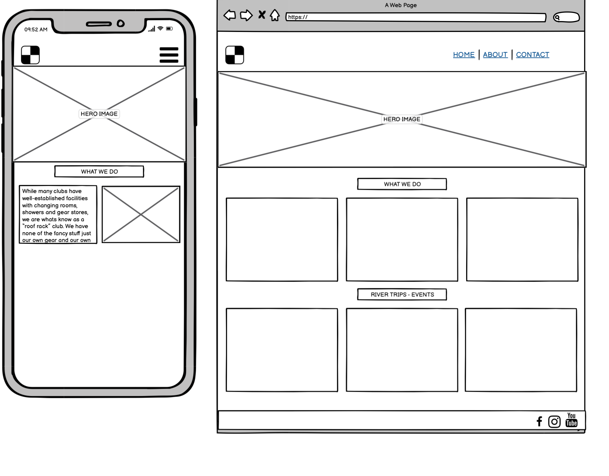
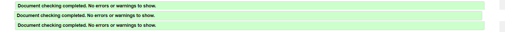
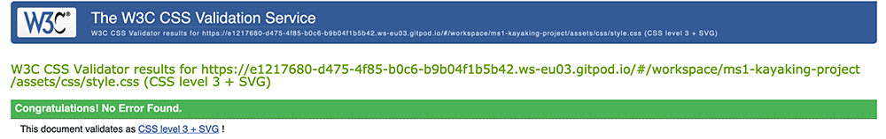
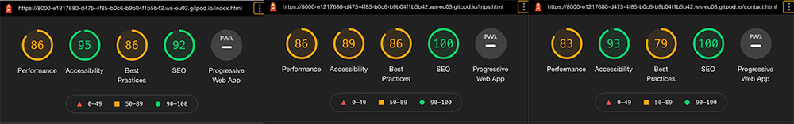

# Rock Hoppers Kayaking Club

*** 

## About  

Rock Hoppers is a Kayaking Club sport website created for my MS1 project with Code Institute.

Rock Hoppers are a niche Kayaking club that offer membership for intermediate/advanced kayakers and playboaters, who have already completed beginners courses and training outside of the club. They are a 'roof rack' club which means that they do not have facilities or a premises like traditional club houses. They do not have a clubhouse, changing rooms or club gear for members but this keeps the membership cost low. You are expected to have your own kayak, gear or vehicle to get you to the rivers. They are members of Canoeing Ireland of which all members will have the option of joining if not a member already. 

There is a scope to add a blog with upcoming events, river trips, kayaking holidays and the integration of a membership system. The events can be paid for or booked using an external provider such as Eventbrite. A big part of the website will be to link members to each other via social media and platforms such as Whatsapp so they can organise meetups and river sessions. Forums are hard to maintain/update and monitor and keep activity going with all members being volunteers.  At the moment payment is taken by cash or revolut but is hard to keep track of financially. 
   

***

## Index – Table of Contents

* [User Experience (UX)](#user-experience) 
* [Features](#features)
* [Designs](#designs)
* [Technologies Used](#technologies-used)
* [Testing](#testing)
* [Known Bugs](#known-bugs)
* [Deployment](#deployment)
* [Acknowledgements](#credit)

*** 

## User Experience (UX)

## Strategy
### User Stories  

#### Reasons a user may visit the website
* A user looking for to join a kayaking club in Ireland
* A user looking for an established club with experienced members/peers so that they can advance in the sport.
* A user is looking for a social club that is friendly and welcoming.
* A user is looking for a roof-rack club as they already have their own gear/boat and don't want that factored into fees.
* A user looking for a club with a lot of river trips/events and kayaking holidays abroad.
* A user is looking for easy ways to connect with other members to organise peer trips and meet ups.
* An inclusive vibe, fun atmosphere, less expense/politics than a bigger club with premises. 

#### Reasons for the website
* Increase club membership, currently membership numbers are low.
* Provide an alternative to members of beginners kayaking clubs where they can join to advance their skills.
* People can join from all over Ireland and meet up at various river locations.
* A lot of other kayaking club websites are poorly maintained, have a bad UXD and are very dated.
* No fixed premises so contacting the comittee is dificult so a website is important to provide information and contact details.

## Scope
#### What a user may expect
* Easy to navigate website 
* Good presentation and visually appealing regardless of screen size.
* Able to view the site on any device they may have, including mobile, tablet, desktop.
* Links and functions work as expected.
* Information about upcoming river trips, meet ups and events.
* A way to get in contact with other members but primarily invitation to Whatsapp groups and the Facebook page/group for regular events.

#### What a user may want 
* To be able to find links to social media pages.
* To join the club with/without Canoeing Ireland Membership.
* Find out about upcoming events and trips.
* To sign up to events/trips/pool sessions online.
* How it works - from start to finish, i.e., who the club are, how many members, how to join, how many trips are there? Are there trainings/courses etc? Is there room for progression?
* Winter pool sessions to learn to roll and refine techniques in a safe/warm environment.
* To sign up and pay for membership online (potential for Adult/Student/Couples membership) - future implementation.

#### As a developer / Club I expect
* To provide information about the club - history, USP.
* To provide an easy way for new and existing members to contact us.
* To list the regular weekly trips, rivers we run and annual trips away
* To provide an easy to navigate website with links that work as expected.
* To showcase members testimonies and expect potential members to read them.
* To encourage clients to use contact us page for membership/trips enquiries. 

* Note that not all -What the user may wants- will be implemented at this step in the club development as this would need volunteers and resources from the club (committee) to manage during their free time. Additional features may be added as the scope mandate changes and the club grows.

## Structure
The website will consist of 3 separate pages
* A home page with “What we do”, and a "River Trips / Events" section. 
* A “Events/Trips” page with a list of upcoming weekly and annual events.
* A page with a form to contact the club and enquire about membership and events.

***

## Designs

## Surface

#### Colour

I have used dark grey as my main colour theme for the website. This has been paired with an off-white colour and orange for contrast. This will help with Accessibility for visually impaired users. This goes with the theme of the website and the club logo. Most other Kayaking clubs use the same blue colour so the choices here were to make the website stand out.  

These colours feature alot throughout the website which is why I have set a variable in the code.

I have used the following 

     :root {
    --main-green: #0b720b;
    --off-white: #fdfdfd;
    --main-orange: orange;
    --dk-grey: #525252;
}
    
This means if the club decides at any point to change the key colours they can easily change it in the variable so that they do not need to go through and change every colour individually.     

For the rest of the colour scheme, I have kept the range of colours to a minimum using only a few additional colours where needed. I have used a dark grey and orange for some text. This still ties in with the theme of the website but provides a better design. Another reason I have chosen not to use black and white is because it is estimated that 20% of the general population has a form of visual stress (significantly higher percentage in those with disorders such as dyslexia). It is a processing perception problem which can cause issues with processing text and patterns. Black on white has been shown as one of the most difficult for sufferers of visual stress to read.

I initially used https://mycolor.space/ to help me narrow down my design choice after using the colour picker on my hero image. I had already decided to use green but hadn’t decided on the exact shade. Although this was helpful in finding colours that worked well, I chose to alter the palette to my choosing.

I have purposely not used any red on the website as this may have cause issues for people with a red/green colour deficiency.

#### Typography 

I have used https://fonts.google.com/ for my fonts.  I have chosen to use the Oswald Font for my headers and Oxygen as a complementary fonto to Oswald, as my main font throughout the website.  This is a fairly modern style that is easy to read at various sizes.  To increase the readability, I have increased the letter spacing in most cases.  To find the compatiblity of fonts I referred to https://typ.io/fonts/oswald

For the use in the headers, I have increased the letter spacing further to make the headings more defined and stand out. I have also used a variety of font weights to make some sections easier to read and stand out. 

I imported the following code into the top of my style.css file

        @import url('https://fonts.googleapis.com/css2?family=Oswald:wght@200;300;400;500;600;700&family=Oxygen:wght@300;400;700&display=swap');

#### Call to Action

I made all my call to actions as easy to see as possible. 

* The links in the Nav/Logo are highlighted using a change in background colour and text colour when the mouse is hovered over them.
* Contact Us is styled as a button to be more inviting for the users to click in the footer.  I have used a complete colour switch when the mouse is hovered over the link so that the user can clearly see it is a link.
* "Submit link" on the form and the "Contact Us" link in the form have also been styled as a button with a complete colour switch.  The colour used are the 2 main colours for consistency and because the change between the colours is easy to see. 
* The social links will send the user to the company's social media pages.  They also change colour when hovered over.

### Imagery   

I used kayaking photos mostly that I have taken myself to add a sense of excitement, and fun and dynamism for users who are familiar with the sport and to give them a sense of the type of experience they may have when joining the club.

Should the hero or carousel images fail there is a background colour set so that the colours of the text can still be read. The images in the body of the website all have "alt" attributes. This is to ensure that screen readers can describe the image to the user or if the image fails to load. This is also to help with the ranking of the website.

***

## Skeleton 

### Layout 

* I have used responsive design when creating the website. as When the page is expanded from a mobile, some of the content goes from being stacked to being in adjacent coloumnscolumns. This allows the user to see more of the website on a larger screen. I have also set a Max-Width for the site so on very large screens the content stays neat and is well formatted.
* I used Bootstraps for the use of the grid system and for the carousel. I used chrome dev tools in the development of the website and altered the column classes in devtools first before implamentingimplementing into my code.
* I have also used a max-width on some pages, this is to ensure the content still looks good.

#### Homepage Wire Frame 

 

***

### Mockup

***

## Features

#### Universal Features Across the Site

###### Logo and Navigation Bar
The Navigation Bar is at the top of the webpage. The logo and nav links all change colour and are highlighted when hovered over. The nav links direct the user to the correct page of the website. When the logo is clicked on it will take the user to the home page. When the page is active, I used bootstraps class .text-uppercase. This causes all the letters to be capitalized and made the text a different colour. By having both these features accessibility is improved. When on smaller devices the nav goes underneath the logo and it is centred. For the larger screens, the nav is aligned to the right-hand side of the page and is on the same line as the Logo. The colour of the nav is dark grey with lighter grey nav links.

###### Responsiveness

The page is scaled up and down for different screen resolutions to help the content stay neat. This has been done using a mixture of media queries and Bootstraps responsive columns.

###### Accessibility

All images and navigations have an alt attributes or aria-label. This is to make the site easier to use for people with visual impairments by allowing them to navigate the site easily. There is high contrast used throughout the design. Header elements have been used in sequence so that the site makes semantic sense to screen readers. Links are consistent when hovered over. I have also set the font to rem so that if someone has their font settings higher for visibility the font size will increase accordingly.

###### Footer 

The footer is split into 3 sections:. “Trips, “Contact Us” and “Social”. The colour used for the background is dark grey to match the nav. Theses The three sections are stacked on smaller devices and are arranged in 3 coloumns on larger devices.

The “Trips" section contains a link to bring users to the Trips page so they can view any events. The “Contact Details” section is a button to the contact page as there is no phone number. The last section “Social” section has links to social media sites using Icons from Font Awesome. When hovered over these links change from a light grey colour to an orange colour.

##### Meta data

I have included descriptions, author, and keywords into the head element to increase traffic to the website. I have also labelled each page differently so that if the user has multiple tabs open it is easy to recognise each tab.

#### Features Specific to Pages

###### Homepage 
* A 3 slide carousel with photos of kayaking with text overlay and buttons to the 3 main pages and a slogan to entice users to continue reading.
* A What we do 3 column section showing the 3 disciplines of kayaking and images of these disciplines.
* A River trips section split into 3 columns showing River Trips, Events, and Kayaking Trips Abroad.

###### River Trips
* A River Trips page split between Blog Articles and a gutter with events. In the future this can be logged to blog posts, Events and Trips Abroad
* This page has a hero image promoting Kayaking.
 

###### Form 
* The “Form” page consists of the form and universal features only. The fields are validated except for Comments.
* The form includes fields for the user to enter their First Name and last name - input type="text"
* The email input field requires the answer to be an email.
* The preferred contact method is selected using a radio button. This is because there is an option for both contact methods to be selected. By using a radio button errors are avoided that may upset the user.
* Options they would like to talk about is a checklist. This is to ensure the submitted form goes to the correct team.
* There is a - textarea - to allow the user to comment and ask questions.
* The submit button is large and changes colour when hovered over.
* The form is stacked for mobile use. For the larger screens, the radio buttons and check list appear inline.
* The labels are clear as to what should go in the field and all fields are set to “required”.

I have set the form to POST with an action of "contact.php" this will not currently go anywhere as github pages is static hosting only. 

### Future Features 

* Nav collapses on mobile
* Has a log in area where users can chat online with members of the team and has the ability to share designs and discuss offers.
* Has a “form submitted” status to give users peace of mind that the form has been sent correctly and sends the form to a committee email.
* Create a membership area linked to an events provider.

    

***

## Technologies Used 

* HTML5 - Mark-up language using semantic structure.
* CCS3 - Cascading style sheet used to style.
* Gitpod.io - for writing the code. Using the command line for committing and pushing to Git Hub
* GitHub - Used to host repository 
* GIT - for version control of the project.

Design 
* [Bootstrap](https://getbootstrap.com/) - For responsive design/carousel - overwritten some code within my own stylesheet
* [Google fonts](https://fonts.google.com/) - For styling the typography
* [Balsamiq wireframe](https://balsamiq.com/) - To build wireframes in the design phase. 
* [Font Awesome](https://fontawesome.com/) - for social media icons
* [Beautifer](https://beautifier.io/) - Allowing me beautify my code.
* [Tiny PNG](https://tinypng.com/) – changing some images to smaller sizes

Testing 
* [HTML Validator](https://validator.w3.org/) - Testing validity of HTML
* [CSS Validator](https://validator.w3.org/) -Testing validity of CSS
* [IE NetREnderer](https://netrenderer.com/index.php)
* [Am I Responsive](http://ami.responsivedesign.is/#) - Checking the responsive nature
* [Wave](https://wave.webaim.org/) - Accessibility Testing 
* DEV Tools - Lighthouse

***

## Testing 

* Nav links work correctly and the user is directed to the correct page of the site. 
* Logo takes the user back to the main page.
* Contact page and Trips page opens links to Form.
* Hovers over links are clear and not default blue.
* Social links works. 
    
[HTML Validator](https://validator.w3.org/)

[CSS Validator](https://validator.w3.org/)

A few warnings were displayed when using the HTML validator. I had left out some alt tags. These were added. I am happy with the outcome of these tests.

### Usability Testing

I sent the project to a couple of friends within the industry.  I had them check to ensure all links were working and the website was responsive at different screen resolutions.

I wanted to carry out Accessibility Testing on the website.  I used [Wave](https://wave.webaim.org/) This was to check to make sure the website the website would work well with screen readers.  I also manually checked the web site by increased the REM settings on my browser and making sure that the content was still visible.  This highlighted a BUG which was FIXED prior to deployment. 

    
### Browser Compatibility

Tested on Chrome, Firefox, Brave, Internet Explorer, Microsoft Edge, Safari.
I tested on older version of Internet Explorer, the website works from Internet Explore 9 and onwards, although not all the content is as designed the overall layout means the content is still easy to read and the images are still visible. 
I used [IE NetREnderer](https://netrenderer.com/index.php) to test the older versions. 

### OS Compatibility
Tested on iOS, Android 10, and Windows 10. - I asked a friend with an IPhone to test that it was working.  I have an Android.
Tested for responsiveness using Chrome DevTools.

### Performance Testing
Tested on the Developer Tools Lighthouse. 

I made some changes, such as increasing contrast, adding meta data and making sure my HTML was semantic and this was the results.

I'm happy with the results but can improve them in the future by deferring css and scripts to the bottom of the page, removing unnessary code and adding caching.

### Testing User Stories

* ###### A user looking for office plants to add to the office or workspace or business. 
The user can find the information quickly on the first page of the site. The user is given the option to get in contact with us and can have a look at testimonies and images of work carried out.
* ###### A user looking to install a plant feature. 
The user can easily see that this is something we offer.   
The user is given the option to get in contact and can have a look at testimonies and images of work carried out previously. 
* ###### A user who already has a quotation but wants to get in contact.
The user can find our contact details in the footer, this includes a phone number, address, and email.  There is also a big button that the user can click to be taken to a page to contact us. 
* ###### A user doing research on what we offer. 
The user can find information about what services we offer on the main page, can then go onto looking at testimonies and images of work we have previously carried out. Each tab has a different description so if the user has more than one tab open they can navigate between them easily. 
* ###### A user looking to see if we have done previous work. 
Easy to navigate to and from the main page. Testimonials clearly seen in the nav bar.
* ###### A user showing the site to other people within their business.   
Max-width set so if the site is being shown in a meeting or on a larger screen the content still looks presentable. 

* ###### A user looking for to join a kayaking club in Ireland.
The user can find out about the Club and the type of kayaking they offer as well as links to a River Trips and events page.
* ###### A user looking for an established club with experienced members/peers so that they can advance in the sport.
The user can find out about the club by promotional text information on the sliders and home page.
* A user is looking for a social club that is friendly and welcoming.
 A user can see photos of club members enjoying themselves on trips on the home page and Trips pages as well as stories of trips.
* A user is looking for a roof-rack club as they already have their own gear/boat and don't want that factored into fees.
* ###### A user looking for a club with a lot of river trips/events and kayaking holidays abroad.
    A user can read about river trips and events on the bottom section of the homepage and clicking on links there and also via the navigation menu.
* ###### A user is looking for easy ways to connect with other members to organise peer trips and meet ups.
    The user can contact us via the contact us page. There is a link to this in the navigation and footer.

*** 

## Deployment 

### Adding and Committing files

To add files to the repository take the following steps

In the command line type -
        git add .  
        git commit -m "This is being committed"
        git push

To add all new files or modified file use " ."  - To add a single file use the pathway to the file eg .index.html  or assets/css/style.css
When committing make sure your comments are clear about what changes have been made. 
Pushing will send your work to the repository

### Deployment 

The project was deployed with the following steps

* Logged into git hub
* Clicked the "Settings" button in the menu above the Repository.
* Scroll down the Settings page to the "GitHub Pages" Section.
* Under "Source", click the dropdown called "None" and then select "Master Branch".
* The page will automatically refresh, and a link displaced.  It may take some time for the link to show the website.
* If the page will not load go down to "template" under the "source" and select a template. 
* Scroll back down through the page to locate the now published site link in the "GitHub Pages" section.

### Forking

Forking the GitHub Repository

By forking the GitHub Repository, you can make a copy of the original repository in your own GitHub account.  This means we can view or make changes without making the changes affecting the original.

* Log into GitHub and locate the GitHub Repository.
* At the top of the Repository there is a "Fork" button about the "Settings" button on the menu.
* You should now have a new copy of the original repository in your own GitHub account.

### Cloning 

Making a Local Clone

* Log into your GitHub then find the gitpod repository
* Under the repository name there is a button that says "Clone or download". Click on this button.
* If cloning with HTTPS "Clone with HTTPS", copy this link.
* Open Gitbash
* Change the current working directory to the location where you want the cloned directory to be.
* Type git clone, and then paste the URL you copied earlier.

        $ git clone https://github.com/YOUR-USERNAME/YOUR-REPOSITORY
        Press - Enter- Your local clone will be created.
        $ git clone https://github.com/YOUR-USERNAME/YOUR-REPOSITORY
                > Cloning into `CI-Clone`...
                > remote: Counting objects: 10, done.
                > remote: Compressing objects: 100% (8/8), done.
                > remove: Total 10 (delta 1), reused 10 (delta 1)
                > Unpacking objects: 100% (10/10), done.
[Click Here](https://docs.github.com/en/free-pro-team@latest/github/creating-cloning-and-archiving-repositories/cloning-a-repository) for more info on cloning. 

## Known Bugs 
* BUG -There was an issue with testimonial when the content was view on a phone in landscape mode. FIX - I changed the layout of the page so the content would render better. 
* BUG- The text on the carousel takes a moment to snap to uppercase.  This is likely because of the delay in reaching the Bootstrap style sheet. FIX -Written the follow code directly into my style.css 
         
         .carousel-caption h5, .carousel-caption p {
        color:var(--md-brown);
        font-weight: 600;
        font-size: 1.4rem;
        letter-spacing: 1px;
        text-transform: uppercase;
         }

* BUG- When the rem size is increased on a users screen the text on the hero image is lost and the form is cut off from the bottom.  FIX - Changed the code so that the container-pattern-form was set to min-content.  I changed the position of the jumbotron.  
* BUG The links to social media were not working. Noticed the links to the fav icons were missing some " and breaking the links. 

***

## Acknowledgements

### Credit

* Brian Macharia- Mentor support, guidance, tips, and key things to look out for throughout the project. Helping me to check for errors and looking at my code. 
* Matt Rudge - Template for gitpod.io 

* [Bootstrap](https://mdbootstrap.com/)  - Carousel used and customised for use in the project. 
* [Code Institute SampleREADME](https://github.com/Code-Institute-Solutions/SampleREADME)
* [Code Institute README Template](https://github.com/Code-Institute-Solutions/readme-template)
* [W3schools](https://www.w3schools.com/) - for various code information and trouble shooting.
* [Google fonts](https://fonts.google.com/) - CDN for the fonts were used in the project.
* [Balsamiq wireframe](https://balsamiq.com/) - To build wireframes in the design phase. 
* [Font Awesome](https://fontawesome.com/) - for social media icons) - CDN for icons used in the project.
* [HTML Validator](https://validator.w3.org/) - Testing validity of HTML.
* [CSS Validator](https://validator.w3.org/) -Testing validity of CSS.
* [IE NetREnderer](https://netrenderer.com/index.php)
* [Am I Responsive](http://ami.responsivedesign.is/#) - Checking the responsive nature.
* [Beautifer](https://beautifier.io/) - Allowing me beautify my code.
* [Tiny PNG](https://tinypng.com/) – changing some images to smaller sizes
* [HTML Online](https://html-online.com/articles/smart-404-error-page-redirect/) - Redirect page 

*** 

### Code:

*  Bootstrap library was used to create a responsive design.
Carousel taken directly from bootstrap - altered to fit needs 

        

        <ol class="carousel-indicators">
            <li data-target="#carouselExampleIndicators" data-slide-to="0" class="active"></li>
            <li data-target="#carouselExampleIndicators" data-slide-to="1"></li>
            <li data-target="#carouselExampleIndicators" data-slide-to="2"></li>
        </ol>
        

            

            
            

            

            
            

            

            
            

        

        <a class="carousel-control-prev" href="#carouselExampleIndicators" role="button" data-slide="prev">
            
            Previous
        </a>
        <a class="carousel-control-next" href="#carouselExampleIndicators" role="button" data-slide="next">
            
            Next
        </a>
        

### Content:

Code & Content (not already attributed): Philip Wall

### Inspiration: 

https://wwww.wwkc.net
https://www.canoe.ie
https://www.rockhoppers.ie
https://www.baltokayak.com

